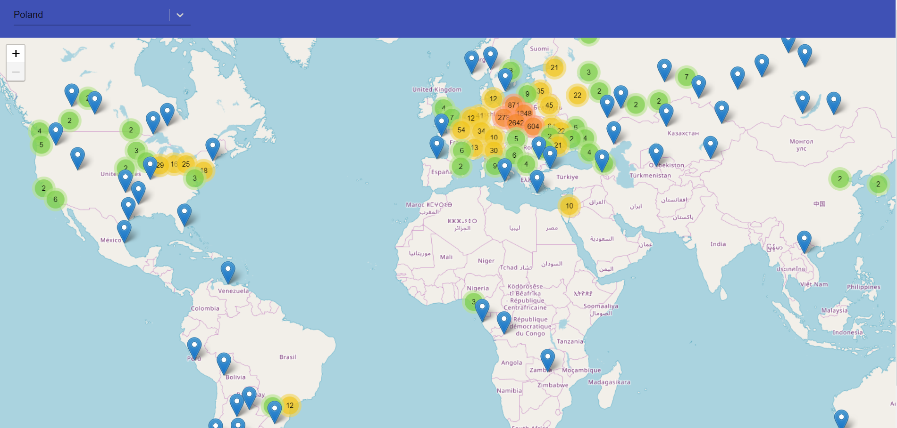

# Wikipedia people place of birth

<p align="center">
Find where people from wikipedia from your country were born
</br>

<a href="https://opensource.org/licenses/MIT">
  
</a>
<a href="https://travis-ci.com/Bartosz-D3V/wiki-map-people">
  
</a>
<a href="https://img.shields.io/badge/code_style-prettier-ff69b4.svg?style=flat-square">
  
</a>
<a href="https://egghead.io/courses/how-to-contribute-to-an-open-source-project-on-github">
  
</a>
</br>


</p>

## About

The following application consumes WikiData resources using SPARQL query.
Select a nationality from the dropdown list and application will draw markers on the map allowing you to see
where people of the selected nationality, present on english wikipedia were born.

## Install

```bash
yarn bootstrap // or...
npm run bootstrap
```

## Run

```bash
lerna run start
```

## Test

```bash
lerna run test
```
